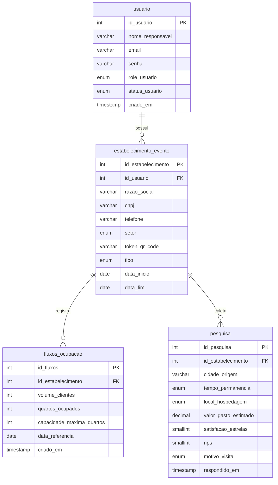

# Esquema do Banco de Dados

Este documento descreve a estrutura do banco de dados do projeto, incluindo as tabelas, colunas e seus relacionamentos.

## Diagrama de Entidade-Relacionamento (ER)

O diagrama abaixo foi gerado com Mermaid e ilustra as conexões entre as tabelas do banco de dados.

## Descrição das Tabelas

### `usuario`
Armazena as informações dos usuários que têm acesso ao sistema, como administradores e lojistas.

-   `id_usuario` (PK): Chave primária.
-   `role_usuario`: Define o nível de permissão (`admin`, `lojista`).

### `estabelecimento_evento`
Contém os dados dos estabelecimentos comerciais e eventos cadastrados. Cada registro está associado a um `usuario`.

-   `id_estabelecimento` (PK): Chave primária.
-   `id_usuario` (FK): Liga o estabelecimento a um usuário responsável.
-   `setor`: Categoria do estabelecimento (ex: `hospedagem`, `alimentacao_comercio`).
-   `tipo`: Diferencia registros permanentes (`fixo`) de temporários (`evento`).

### `fluxos_ocupacao`
Registra dados de fluxo e ocupação para os estabelecimentos, especialmente útil para o setor de `hospedagem`.

-   `id_fluxos` (PK): Chave primária.
-   `id_estabelecimento` (FK): Associa o registro de fluxo a um estabelecimento.
-   `volume_clientes`: Número de clientes atendidos.
-   `quartos_ocupados`: Específico para hotéis e pousadas.

### `pesquisa`
Armazena as respostas das pesquisas de satisfação e perfil de visitante coletadas nos estabelecimentos.

-   `id_pesquisa` (PK): Chave primária.
-   `id_estabelecimento` (FK): Indica onde a pesquisa foi realizada.
-   `cidade_origem`: Ajuda a traçar o perfil do turista.
-   `nps`: Net Promoter Score, para medir a lealdade do cliente.
